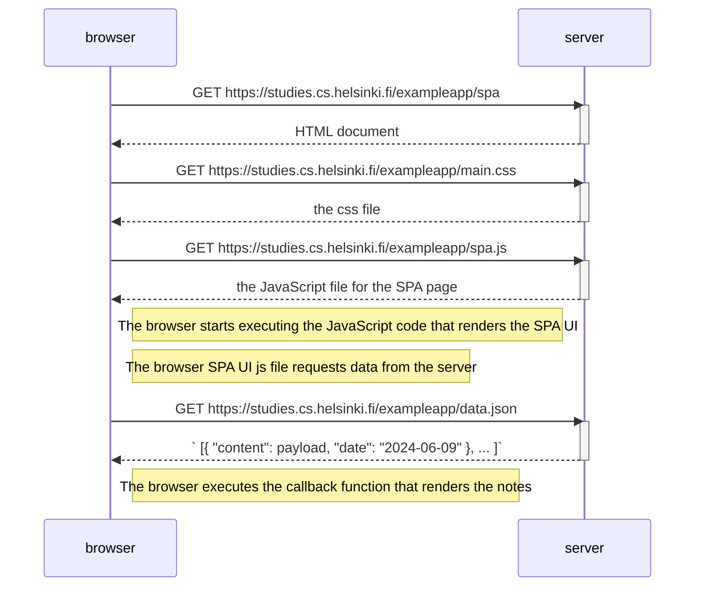

```mermaid
sequenceDiagram
    participant browser
    participant server

    browser->>server: GET https://studies.cs.helsinki.fi/exampleapp/spa
    activate server
    server-->>browser: HTML document
    deactivate server


    browser->>server: GET https://studies.cs.helsinki.fi/exampleapp/main.css
    activate server
    server-->>browser: the css file
    deactivate server

    browser->>server: GET https://studies.cs.helsinki.fi/exampleapp/spa.js
    activate server
    server-->>browser: the JavaScript file for the SPA page
    deactivate server

    Note right of browser: The browser starts executing the JavaScript code that renders the SPA UI
    Note right of browser: The browser SPA UI js file requests data from the server
    browser->>server: GET https://studies.cs.helsinki.fi/exampleapp/data.json
    activate server
    server-->>browser: ` [{ "content": payload, "date": "2024-06-09" }, ... ]`
    deactivate server
    Note right of browser: The browser executes the callback function that renders the notes
```
